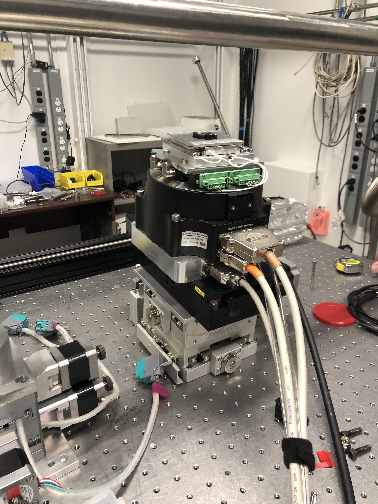
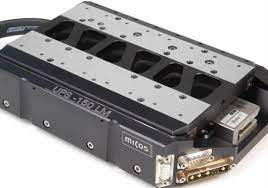
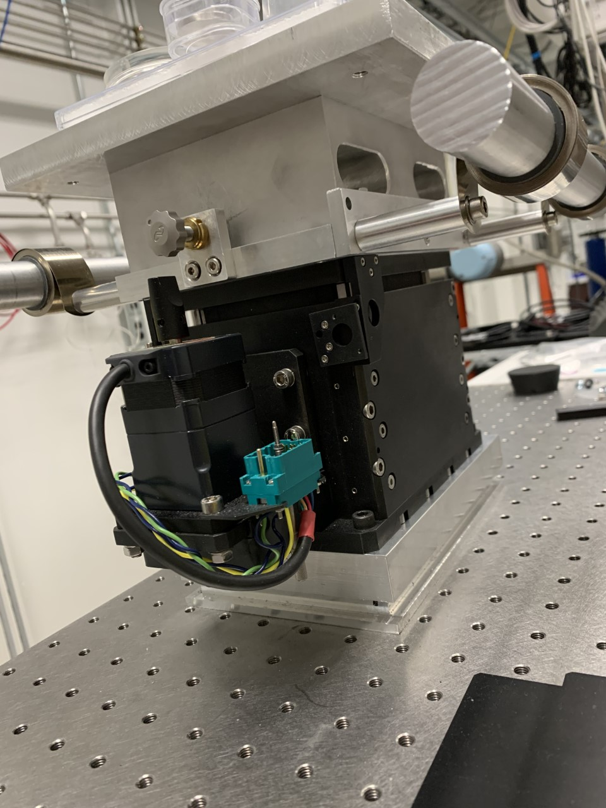
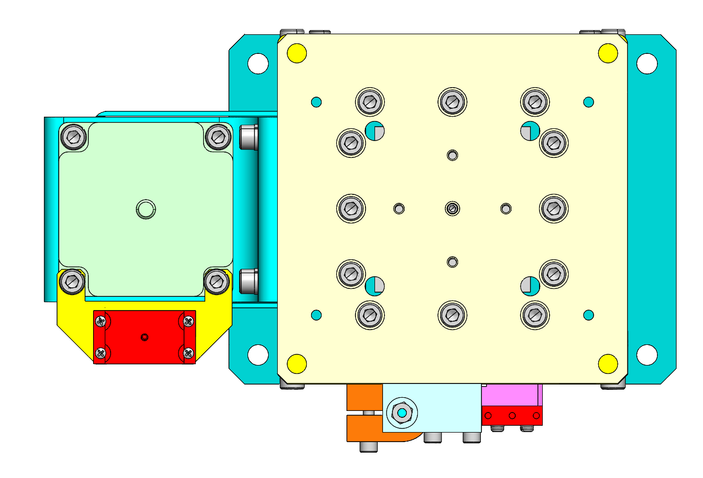
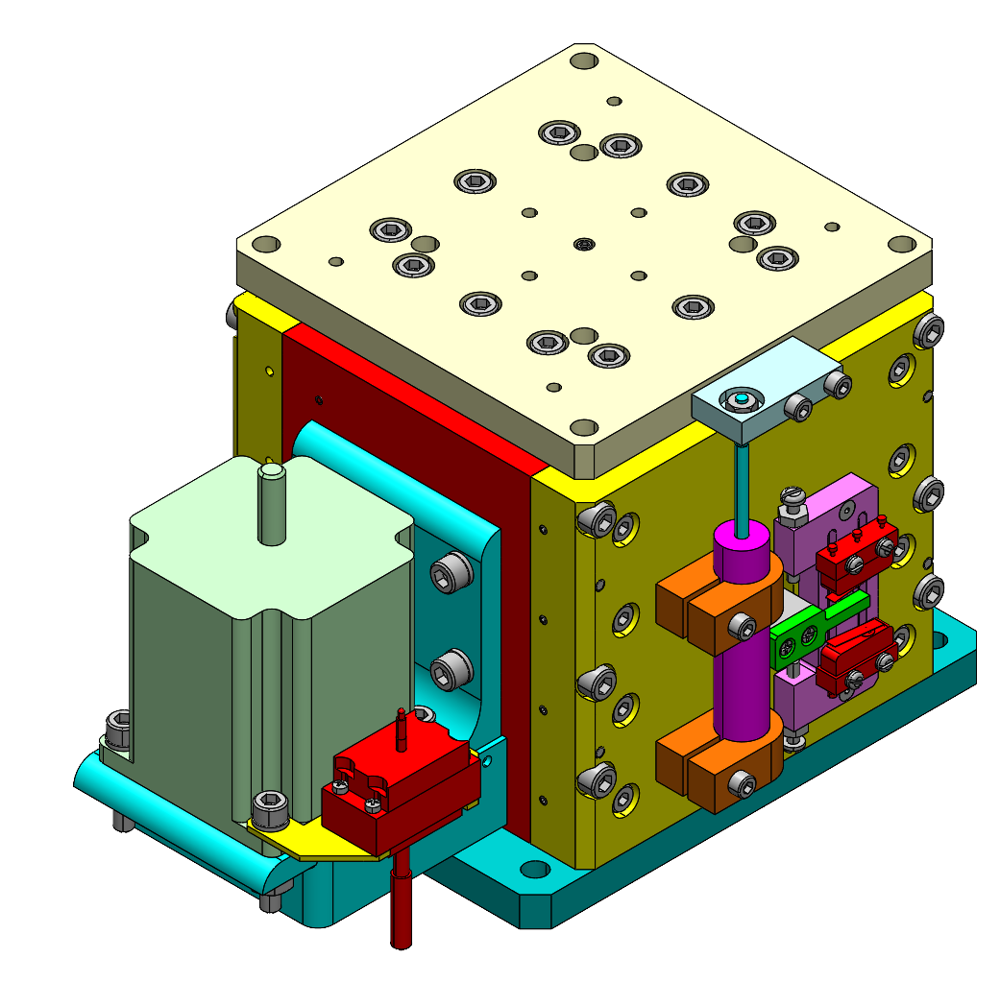

Hardware
========

XRF stack
---------

The XRF sample stack at 2-ID-E consists of:

.. _stage_0001: https://www.smaract.com/pdf-details/en/cls-5252-linear-stage-with-edu
.. _stage_0002: https://www.smaract.com/pdf-details/en/sr-5714
.. _stage_0003: https://www.pi-usa.us/fileadmin/user_upload/pi_us/files/product_datasheets/Linear_Motor_Translation_Stage_LMS_Family.pdf

+---------------------+-----------------------+------------------+------------+------------------+---------------------------------+
| Descriptiom         | Model                 |      Image       |   Driver   |  Base size (mm)  |   Links                         | 
+---------------------+-----------------------+------------------+------------+------------------+---------------------------------+
| Top X-Z             | Smaract SLS5252S-19   |    |00001|       |    MCS2    |   52x52x14       |  `stage_0001`_                  |
+---------------------+-----------------------+------------------+------------+------------------+---------------------------------+
| Rotary stage        | Smaract sr-5714       |    |00002|       |    MCS2    |   57x57x14       |  `stage_0002`_                  |
+---------------------+-----------------------+------------------+------------+------------------+---------------------------------+
| X stage             | PI LMS-230            |    |00003|       |PI Hydra TT |   375x230x72     |  `stage_0003`_                  |
+---------------------+-----------------------+------------------+------------+------------------+---------------------------------+
| Y stage             | Deming                | |00009| |00010|  | Step pack  |                  |                                 |
+---------------------+-----------------------+------------------+------------+------------------+---------------------------------+

Airbearing stack
----------------

.. _stage_0004: https://www.smaract.com/en/linear-stages/product/slc-1780
.. _stage_0005: https://www.micosusa.com/old/UPR_160A.html
.. _stage_0006: https://www.newport.com/p/GTS150
.. _stage_0007: https://www.xhuber.com/en/products/1-components/11-translation/z-stages/5103a20-40/

.. _driver_0004: https://www.smaract.com/en/control-systems-and-software/product/mcs2
.. _driver_0006: https://www.newport.com/p/ESP301-3N

+-------------------+---------------------------+------------------+----------------------------------------------------+---------------------------------+
| Descriptiom       | Model                     |      Image       |                   Driver                           |   Links                         | 
+-------------------+---------------------------+------------------+----------------------------------------------------+---------------------------------+
| Top X-Z           | SLC1780s-151              |    |00004|       |  MCS2 Smaract driver with network                  |  `stage_0004`_ `driver_0004`_   |
+-------------------+---------------------------+------------------+----------------------------------------------------+---------------------------------+
| Rotary stage      | Pi-Micos UPR-160 AIR      |    |00005|       |  MCS-hydra CM driver (delta star eco)              |  `stage_0005`_                  |
+-------------------+---------------------------+------------------+----------------------------------------------------+---------------------------------+
| X-stage           | Newport GTS150            |    |00006|       |  Newport ESP301 controller or XPS-8                |  `stage_0006`_ `driver_0006`_   |
+-------------------+---------------------------+------------------+----------------------------------------------------+---------------------------------+
| Y stage           | Huber 5103.2-302          |    |00007|       |  Any Bipolar stepper motor driver                  |  `stage_0007`_                  |
+-------------------+---------------------------+------------------+----------------------------------------------------+---------------------------------+
| Y stage           | Deming                    |    |00008|       |  Any 5-phase stepper driver (Kohzu)/Oriental motor |                                 |
+-------------------+---------------------------+------------------+----------------------------------------------------+---------------------------------+

  

.. |00002| image:: ../img/SR-5714.jpg 
    :width: 20pt
    :height: 20pt

